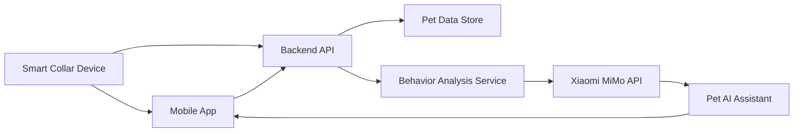

# Kaka Smart Collar

Kaka Smart Collar is an early-stage personal developer project for a pet
health and safety smart collar. The goal is to combine wearable device data,
location tracking, behavior analysis, and large language model reasoning into a
practical assistant for pet owners.

The project is currently in the product planning and technical prototype phase.
This repository will be used to document the product design, architecture,
data model, API experiments, and later source code.

## Vision

Many pet owners can observe obvious behavior changes, but it is hard to turn
daily movement, location, sleep, and environment data into useful decisions.
Kaka Smart Collar aims to provide a simple AI-assisted layer between raw collar
signals and everyday pet care.

The assistant should help answer questions such as:

- Has my pet's activity level changed significantly this week?
- Is there an unusual behavior pattern that needs attention?
- Did my pet leave the safe area?
- What happened during today's walk or outdoor activity?
- What care suggestions can be generated from recent data?

## Planned Features

- Pet activity tracking and daily behavior summaries
- Safe-zone and location-based alerts
- Abnormal behavior detection from activity and rest patterns
- Owner-facing AI chat assistant for pet status questions
- Weekly health and activity reports
- Device data simulation for early development
- Backend API for collar data ingestion and analysis
- Model evaluation prompts for pet behavior interpretation

## AI and MiMo Integration Plan

The project plans to evaluate Xiaomi MiMo API as one of the core intelligence
layers for the product prototype.

MiMo may be used for:

- Summarizing long pet activity logs
- Explaining unusual behavior signals in natural language
- Generating owner-friendly health and safety alerts
- Supporting multi-turn Q&A about recent pet status
- Producing weekly pet care reports
- Assisting development workflows through Agent tools

During the prototype phase, I plan to test MiMo with Codex and Claude Code based
development workflows, and compare model behavior with GPT and DeepSeek series
models.

## Expected Token Usage

The estimated prototype-stage usage is about 1 billion tokens. This includes:

- Prompt engineering and repeated model evaluation
- Multi-turn assistant conversation tests
- Batch analysis of simulated pet activity logs
- Long-context summary tests
- Backend API integration and debugging
- Product copy, alert text, and report generation
- Agent-assisted coding, testing, and documentation

## High-Level Architecture

## Prototype Modules

### Device Data Layer

The first prototype will use simulated collar data before real hardware is
available. Example fields may include:

- pet_id
- timestamp
- activity_level
- location
- battery_level
- temperature
- rest_duration
- unusual_motion_score

### Backend Layer

The backend service will provide APIs for:

- uploading or simulating collar records
- querying daily and weekly pet status
- generating summaries through model calls
- storing model evaluation results
- serving assistant responses to the app layer

### AI Assistant Layer

The assistant will translate raw data into owner-friendly explanations. It
should avoid medical diagnosis and instead provide clear, cautious suggestions,
such as recommending continued observation or contacting a veterinarian when
signals are concerning.

## Development Roadmap

### Phase 1: Product and Data Prototype

- Define product requirements
- Create sample pet behavior datasets
- Design backend data structures
- Build initial prompt templates
- Document MiMo API evaluation plan

### Phase 2: Backend and AI Integration

- Implement data ingestion API
- Add pet status summary endpoint
- Connect MiMo API for text generation and reasoning
- Add model comparison scripts
- Create basic tests for prompt outputs

### Phase 3: App Prototype

- Design pet dashboard page
- Design safety alert page
- Design AI assistant chat page
- Connect app prototype to backend APIs

### Phase 4: Evaluation and Feedback

- Evaluate MiMo responses on simulated pet logs
- Track latency, stability, and output quality
- Refine prompts and data formats
- Write integration notes and public feedback

## Example Use Case

A pet owner opens the app after work and asks:

> How was Kaka today?

The system reads recent activity and location records, summarizes the day, and
returns a response such as:

> Kaka was more active than usual this afternoon and spent about 40 minutes near
> the west side of the park. Rest time was slightly lower than the weekly
> average. No safe-zone violation was detected. You may want to give Kaka a
> quieter evening and observe whether the higher activity continues tomorrow.

## Status

This repository is under active planning. Code, API examples, prompts, and
prototype screenshots will be added as the project progresses.

## License

This project is currently published for prototype documentation and developer
grant application purposes. A formal license will be added before production
code is released.
